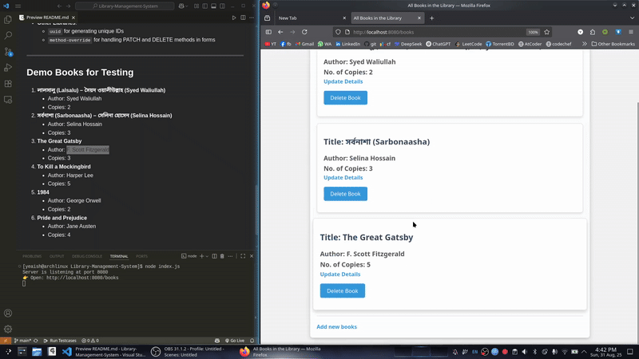

# Library Management System

This is a simple Library Management System built using **Node.js**, **Express.js**, and **EJS** templates. It allows users to manage books in a library, performing basic CRUD operations: Create, Read, Update, and Delete.

---

## Features

1. **Add Books**: Users can add new books to the library by providing the title, author, and number of copies.
2. **View All Books**: Displays all the books currently stored in the library.
3. **Update Book Details**: Users can update the details of a book, such as the title, author, or number of copies.
4. **Delete Books**: Allows users to remove books from the library.
5. **Responsive and User-Friendly Design**: Styled with a simple CSS stylesheet for clean and intuitive interaction.

---

## Prerequisites

Ensure you have the following installed:

- **Node.js** (v14 or higher)
- **npm** (Node Package Manager)

---

## Installation

1. **Clone the Repository**:

   ```bash
   git clone https://github.com/YeaishTurj/Library-Management-System.git
   cd Library-Management-System/
   ```

2. **Run the Application**:

   ```bash
   node index.js
   ```

3. Open your browser and navigate to:
   ```
   http://localhost:8080/books
   ```

---

## Project Structure

```
Library-Management-System/
├── demo/
│   └── library_management_demo_gif.gif    # GIF preview of the demo
├── node_modules/                          # Project dependencies
├── public/
│   └── styles.css                         # CSS styling
├── views/
│   ├── addBook.ejs                        # Form to add a book
│   ├── allBooks.ejs                       # View all books
│   └── updateBook.ejs                     # Form to update a book
├── index.js                               # Main server file
├── package.json                           # Project config & dependencies
├── package-lock.json                      # Lock file for npm
└── README.md                              # Project documentation
```

---

## Routes

| Method | Route            | Description               |
| ------ | ---------------- | ------------------------- |
| GET    | `/books`         | Display all books         |
| GET    | `/books/newBook` | Form to add a new book    |
| POST   | `/books`         | Add a new book            |
| GET    | `/books/:id`     | Form to edit book details |
| PATCH  | `/books/:id`     | Update book details       |
| DELETE | `/books/:id`     | Delete a book             |

---

## Technologies Used

- **Backend**: Node.js, Express.js
- **Frontend**: EJS (Embedded JavaScript), HTML, CSS
- **Other Libraries**:
  - `uuid` for generating unique IDs
  - `method-override` for handling PATCH and DELETE methods in forms

---

## Demo

Quick preview:



Full demo video:

[](https://youtu.be/BTPQYe33ous)

_(Click the image above to watch the demo on YouTube)_

---

## Demo Books for Testing

1. **লালসালু (Lalsalu) – সৈয়দ ওয়ালীউল্লাহ (Syed Waliullah)**

   - Author: Syed Waliullah
   - Copies: 2

2. **সর্বনাশা (Sarbonaasha) – সেলিনা হোসেন (Selina Hossain)**

   - Author: Selina Hossain
   - Copies: 3

3. **The Great Gatsby**

   - Author: F. Scott Fitzgerald
   - Copies: 3

4. **To Kill a Mockingbird**

   - Author: Harper Lee
   - Copies: 5

5. **1984**

   - Author: George Orwell
   - Copies: 2

6. **Pride and Prejudice**

   - Author: Jane Austen
   - Copies: 4

7. **Moby Dick**
   - Author: Herman Melville
   - Copies: 1
